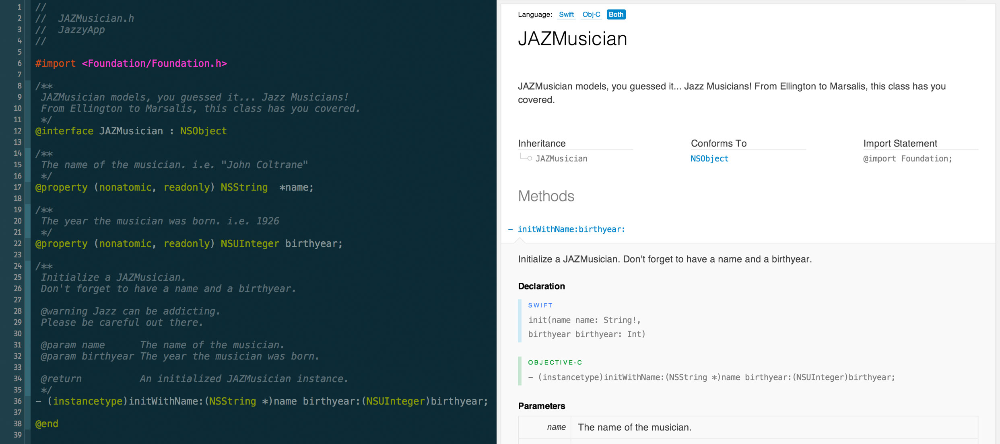

## jazzy ♪♫
**a soulful way to generate docs for Swift & Objective-C** 

jazzy is a command-line utility that generates documentation for your Swift or Objective-C projects.

Instead of parsing your source files, jazzy hooks into clang and uses the [AST][ast] representation of your code and its comments for more accurate results.

jazzy’s output matches the look & feel of Apple’s official reference documentation, post WWDC 2014.

### Requirements

* [Xcode 6 (Beta 2)](https://developer.apple.com/xcode)
* `xcode-select -p` should print Xcode 6's path. If it doesn't, run `sudo xcode-select -s /Applications/Xcode6-Beta2.app/Contents/Developer`

### Installing

To install jazzy, run `[sudo] gem install jazzy` from your command line.

### Usage

Run `jazzy` from your command line. Run `jazzy -h` for a list of additional options.

### Design Goals

jazzy's main design goals are:

- Generate source code docs matching Apple's official reference documentation
- Support for Xcode and Dash docsets
- High readability of source code comments
- Leverage modern HTML templating ([Mustache](http://mustache.github.io))
- Leverage the power and accuracy of the [Clang AST][ast]
- Compatibility with [appledoc](https://github.com/tomaz/appledoc) when possible

### License

This project is under the MIT license.

[ast]: http://clang.llvm.org/docs/IntroductionToTheClangAST.html "Introduction To The Clang AST"
