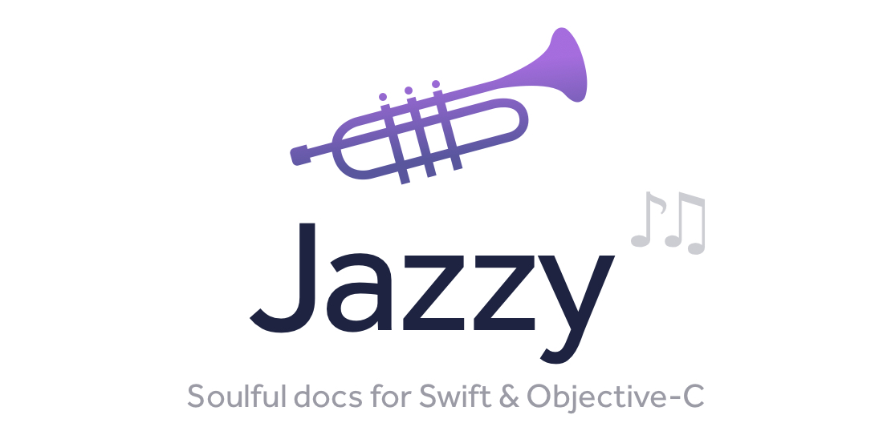
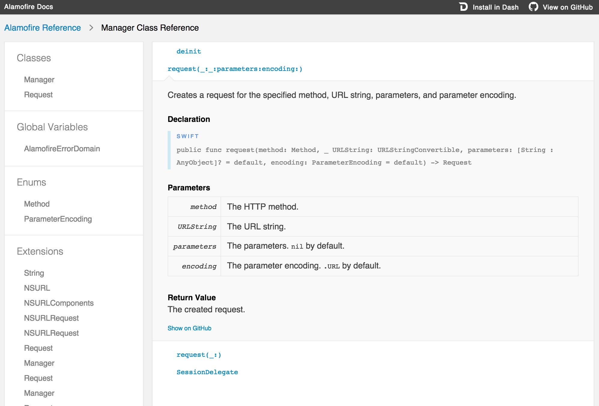

[](https://circleci.com/gh/realm/jazzy)

*jazzy is a command-line utility that generates documentation for Swift or Objective-C*

## About

Both Swift and Objective-C projects are supported.

*Objective-C support was recently added, so please report any issues you find.*

Instead of parsing your source files, `jazzy` hooks into [Clang][clang] and
[SourceKit][sourcekit] to use the [AST][ast] representation of your code and
its comments for more accurate results. The output matches the look and feel
of Apple’s official reference documentation, post WWDC 2014.



This project adheres to the [Contributor Covenant Code of Conduct](https://realm.io/conduct).
By participating, you are expected to uphold this code. Please report
unacceptable behavior to [info@realm.io](mailto:info@realm.io).

## Requirements

* A version of [Xcode][xcode] capable of building the project you wish to
document. It must be installed in a location indexed by Spotlight for the
`--swift-version` configuration option to succeed.

## Installation

```shell
[sudo] gem install jazzy
```

The Xcode command-line developer tools must be installed to successfully build
the gems that `jazzy` depends on: try `xcode-select --install` if you see build
errors.

## Usage

Run `jazzy` from your command line. Run `jazzy -h` for a list of additional options.

If your Swift module is the first thing to build, and it builds fine when running
`xcodebuild` without any arguments from the root of your project, then just running
`jazzy` (without any arguments) from the root of your project should succeed too!

You can set options for your project’s documentation in a configuration file,
`.jazzy.yaml` by default. For a detailed explanation and an exhaustive list of
all available options, run `jazzy --help config`.

### Supported keywords

Swift documentation is written in markdown and supports a number of special keywords.
For a complete list and examples, see Erica Sadun's post on [*Swift header documentation in Xcode 7*](https://ericasadun.com/2015/06/14/swift-header-documentation-in-xcode-7/),
her [book on Swift Documentation Markup](https://itunes.apple.com/us/book/swift-documentation-markup/id1049010423), and the [Xcode Markup Formatting Reference](https://developer.apple.com/library/content/documentation/Xcode/Reference/xcode_markup_formatting_ref/).

For Objective-C documentation the same keywords are supported, but note that the format
is slightly different. In Swift you would write `- returns:`, but in Objective-C you write `@return`. See Apple's [*HeaderDoc User Guide*](https://developer.apple.com/legacy/library/documentation/DeveloperTools/Conceptual/HeaderDoc/tags/tags.html) for more details. **Note: `jazzy` currently does not support _all_ Objective-C keywords listed in this document, only @param, @return, @warning, @see, and @note.**

Jazzy can also generate cross-references within your documentation. A symbol name in
backticks generates a link, for example:
* \`MyClass\` - a link to documentation for `MyClass`.
* \`MyClass.method(param1:)\` - a link to documentation for that method.
* \`MyClass.method(...)\` - shortcut syntax for the same thing.
* \`method(...)\` - shortcut syntax to link to `method` from the documentation of another
  method or property in the same class.
* \`[MyClass method1]\` - a link to an Objective-C method.
* \`-[MyClass method2:param1]\` - a link to another Objective-C method.

### Swift

Swift documentation is generated by default.

##### Example

This is how Realm Swift docs are generated:

```shell
jazzy \
  --clean \
  --author Realm \
  --author_url https://realm.io \
  --github_url https://github.com/realm/realm-cocoa \
  --github-file-prefix https://github.com/realm/realm-cocoa/tree/v0.96.2 \
  --module-version 0.96.2 \
  --xcodebuild-arguments -scheme,RealmSwift \
  --module RealmSwift \
  --root-url https://realm.io/docs/swift/0.96.2/api/ \
  --output docs/swift_output \
  --theme docs/themes
```

### Objective-C

To generate documentation for Objective-C headers, you must pass the following
parameters to jazzy:

* `--objc`
* `--umbrella-header ...`
* `--framework-root ...`
* `--sdk [iphone|watch|appletv][os|simulator]|macosx` (optional, default value
   of `macosx`)
* `--hide-declarations [objc|swift]` (optional, hides the selected language
   declarations)

##### Example

This is how Realm Objective-C docs are generated:

```shell
jazzy \
  --objc \
  --clean \
  --author Realm \
  --author_url https://realm.io \
  --github_url https://github.com/realm/realm-cocoa \
  --github-file-prefix https://github.com/realm/realm-cocoa/tree/v2.2.0 \
  --module-version 2.2.0 \
  --xcodebuild-arguments --objc,Realm/Realm.h,--,-x,objective-c,-isysroot,$(xcrun --show-sdk-path),-I,$(pwd) \
  --module Realm \
  --root-url https://realm.io/docs/objc/2.2.0/api/ \
  --output docs/objc_output \
  --head "$(cat docs/custom_head.html)"
```

This is how the AFNetworking docs are generated:

```shell
jazzy \
  --objc \
  --author AFNetworking \
  --author_url http://afnetworking.com \
  --github_url https://github.com/AFNetworking/AFNetworking \
  --github-file-prefix https://github.com/AFNetworking/AFNetworking/tree/2.6.2 \
  --module-version 2.6.2 \
  --umbrella-header AFNetworking/AFNetworking.h \
  --framework-root . \
  --module AFNetworking
```

### Themes

Three themes are provided with jazzy: `apple` (default), `fullwidth` and `jony`.

* `apple` example: <https://realm.io/docs/swift/latest/api/>
* `fullwidth` example: <https://reduxkit.github.io/ReduxKit/>
* `jony` example: <https://harshilshah.github.io/IGListKit/>

You can specify which theme to use by passing in the `--theme` option. You can
also provide your own custom theme by passing in the path to your theme
directory.

### Guides

| Description | Command |
| ---         | ---     |
| Command line option | `--documentation={file pattern}` |
| Example             | `--documentation=Docs/*.md` |
| jazzy.yaml example  | `documentation: Docs/*.md` |

By default, jazzy looks for one of README.md, README.markdown, README.mdown or README (in that order) in the directory from where it runs to render the index page at the root of the docs output directory.
Using the `--documentation` option, extra markdown files can be integrated into the generated docs and sidebar navigation.

Any files found matching the file pattern will be parsed and included as a document with the type 'Guide' when generated. If the files are not included using the `custom_categories` config option, they will be grouped under 'Other Guides' in the sidebar navigation.

There are a few limitations:
- File names must be unique from source files.
- Readme should be specified separately using the `readme_path` option.

### Section description abstracts

| Description | Command |
| ---         | ---     |
| Command line option | `--abstract={file pattern}` |
| Example             | `--abstract=Docs/Sections/*.md` |
| jazzy.yaml example  | `abstract: Docs/Sections/*.md` |

Using the `--abstract` options, extra markdown can be included after the heading of section overview pages. Think of it as a template include.

The list of files matching the pattern is compared against the list of sections generated and if a match is found, it's contents will be included in that section before listing source output.

Unlike the `--documentation` option, these files are not included in navigation and if a file does not match a section title, it is not included at all.

This is very helpful when using `custom_categories` for grouping types and including relevant documentation in those sections.

For an example of a project using both `--documentation` and `--abstract` see: [https://reswift.github.io/ReSwift/](https://reswift.github.io/ReSwift/)

### Controlling what is documented

In Swift mode, Jazzy by default documents only `public` and `open` declarations. To
include declarations with a lower access level, set the `--min-acl` flag to `internal`,
`fileprivate`, or `private`.

In Objective-C mode, Jazzy documents all declarations found in the `--umbrella-header`
header file and any other header files included by it.

You can control exactly which declarations should be documented using `--exclude`,
`--include`, or `:nodoc:`.

The `--include` and `--exclude` flags list source files that should be included/excluded
respectively in the documentation. Entries in the list can be absolute pathnames beginning
with `/` or relative pathnames. Relative pathnames are interpreted relative to the
directory from where you run `jazzy` or, if the flags are set in the config file, relative
to the directory containing the config file. Entries in the list can match multiple files
using `*` to match any number of characters including `/`.  For example:
* `jazzy --include=/Users/fred/project/Sources/Secret.swift` -- include a specific file
* `jazzy --exclude=/*/Internal*` -- exclude all files with names that begin with *Internal*
  and any files under any directory with a name beginning *Internal*.
* `jazzy --exclude=Impl1/*,Impl2/*` -- exclude all files under the directories *Impl1* and
  *Impl2* found in the current directory.

Note that the `--include` option is applied before the `--exclude` option. For example:

* `jazzy --include=/*/Internal* --exclude=Impl1/*,Impl2/*` -- include all files with names
  that begin with *Internal* and any files under any directory with a name beginning
  *Internal*, **except** for those under the directories *Impl1* and *Impl2* found in the
  current directory

Declarations with a documentation comment containing `:nodoc:` are excluded from the
documentation.

## Troubleshooting

#### Swift

**Only extensions are listed in the documentation?**

Check the `--min-acl` setting -- see [above](#controlling-what-is-documented).

## Development

Please review jazzy's [contributing guidelines](https://github.com/realm/jazzy/blob/master/CONTRIBUTING.md) when submitting pull requests.

jazzy is composed of two parts:

1. The parser, [SourceKitten][SourceKitten] (written in Swift)
2. The site generator (written in ruby)

To build and run jazzy from source:

1. Install [bundler][bundler].
2. Run `bundle install` from the root of this repo.
3. Run jazzy from source by running `bin/jazzy`.

Instructions to build SourceKitten from source can be found at
[SourceKitten's GitHub repository][SourceKitten].

## Design Goals

- Generate source code docs matching Apple's official reference documentation
- Support for standard Objective-C and Swift documentation comment syntax
- Leverage modern HTML templating ([Mustache][mustache])
- Leverage the power and accuracy of the [Clang AST][ast] and [SourceKit][sourcekit]
- Support for Dash docsets
- Support Swift and Objective-C (*mixed projects are a work in progress*)

## License

This project is released under the [MIT license](https://github.com/realm/jazzy/blob/master/LICENSE).

## About


Jazzy is maintained and funded by Realm Inc. The names and logos for
Realm are trademarks of Realm Inc.

We :heart: open source software!
See [our other open source projects](https://github.com/realm),
read [our blog](https://realm.io/news) or say hi on twitter
([@realm](https://twitter.com/realm)).

[clang]: https://clang.llvm.org "Clang"
[sourcekit]: https://www.jpsim.com/uncovering-sourcekit "Uncovering SourceKit"
[ast]: https://clang.llvm.org/docs/IntroductionToTheClangAST.html "Introduction To The Clang AST"
[xcode]: https://developer.apple.com/xcode "Xcode"
[SourceKitten]: https://github.com/jpsim/SourceKitten "SourceKitten"
[bundler]: https://rubygems.org/gems/bundler
[mustache]: https://mustache.github.io "Mustache"
