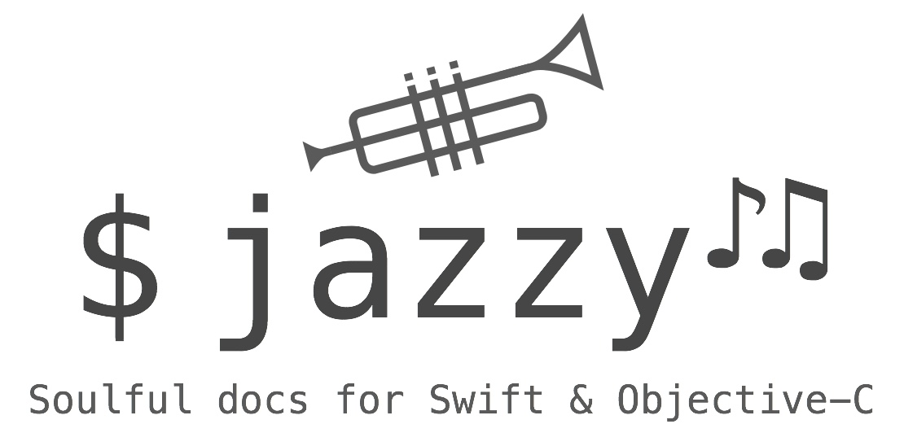

*jazzy is a command-line utility that generates documentation for Swift or Objective-C*

## About

Both Swift and Objective-C projects are supported.

*Objective-C support was recently added, so please report any issues you find.*

Instead of parsing your source files, `jazzy` hooks into [Clang][clang] and
[SourceKit][sourcekit] to use the [AST][ast] representation of your code and
its comments for more accurate results. The output matches the look and feel 
of Apple’s official reference documentation, post WWDC 2014.


This project adheres to the [Contributor Covenant Code of Conduct](https://realm.io/conduct).
By participating, you are expected to uphold this code. Please report
unacceptable behavior to [info@realm.io](mailto:info@realm.io).

## Requirements

* A version of [Xcode][xcode] (6.x or 7.x) capable of building the project 
you wish to document. It must be installed in a location indexed by Spotlight.

## Installation

```shell
[sudo] gem install jazzy
```

## Usage

Run `jazzy` from your command line. Run `jazzy -h` for a list of additional options.

If your Swift module is the first thing to build, and it builds fine when running
`xcodebuild` without any arguments from the root of your project, then just running
`jazzy` (without any arguments) from the root of your project should succeed too!

You can set options for your project’s documentation in a configuration file,
`.jazzy.yaml` by default. For a detailed explanation and an exhaustive list of
all available options, run `jazzy --help config`.

### Supported keywords

Swift header documentation is written in markdown and supports a number of special keywords.
For a complete list and examples, see Erica Sadun's post on [*Swift header documentation in Xcode 7*](http://ericasadun.com/2015/06/14/swift-header-documentation-in-xcode-7/).

For Objective-C documentation the same keywords are supported, but note that the format
is slightly different. In Swift you would write `- returns:`, but in Objective-C you write `@return`. See Apple's [*HeaderDoc User Guide*](https://developer.apple.com/library/mac/documentation/DeveloperTools/Conceptual/HeaderDoc/tags/tags.html) for more details. **Note: `jazzy` currently does not support _all_ Objective-C keywords listed in this document.**

### Swift

Swift documentation is generated by default.

##### Example 

This is how Realm Swift docs are generated:

```shell
jazzy \
  --clean \
  --author Realm \
  --author_url https://realm.io \
  --github_url https://github.com/realm/realm-cocoa \
  --github-file-prefix https://github.com/realm/realm-cocoa/tree/v0.96.2 \
  --module-version 0.96.2 \
  --xcodebuild-arguments -scheme,RealmSwift \
  --module RealmSwift \
  --root-url https://realm.io/docs/swift/0.96.2/api/ \
  --output docs/swift_output \
  --theme docs/themes
```

### Objective-C

To generate documentation for Objective-C headers, you must pass the following
parameters to jazzy:

* `--objc`
* `--umbrella-header ...` 
* `-framework-root ...`
* `--sdk [iphone|watch|appletv][os|simulator]|macosx` (optional, default value
   of `macosx`)

##### Example

This is how Realm Objective-C docs are generated:

```shell
jazzy \
  --objc \
  --clean \
  --author Realm \
  --author_url https://realm.io \
  --github_url https://github.com/realm/realm-cocoa \
  --github-file-prefix https://github.com/realm/realm-cocoa/tree/v0.96.2 \
  --module-version 0.96.2 \
  --umbrella-header Realm/Realm.h \
  --framework-root . \
  --module Realm \
  --root-url https://realm.io/docs/objc/0.96.2/api/ \
  --output docs/objc_output \
  --theme docs/themes
```

This is how the AFNetworking docs are generated:

```shell
jazzy \
  --objc \
  --author AFNetworking \
  --author_url http://afnetworking.com \
  --github_url https://github.com/AFNetworking/AFNetworking \
  --github-file-prefix https://github.com/AFNetworking/AFNetworking/tree/2.6.2 \
  --module-version 2.6.2 \
  --umbrella-header AFNetworking/AFNetworking.h \
  --framework-root . \
  --module AFNetworking
```

### Themes

Two themes are provided with jazzy: `apple` (default) and `fullwidth`.

Here's an example built with `apple`: <https://realm.io/docs/swift/latest/api/>

Here's an example built with `fullwidth`: <http://reduxkit.github.io/ReduxKit/>

You can specify which theme to use by passing in the `--theme` option. You can
also provide your own custom theme by passing in the path to your theme
directory.

## Troubleshooting

#### Swift

**Only extensions are listed in the documentation?**

By default, `jazzy` only documents public declarations. To generate documentation
for declarations with a lower accessibility level (`internal` or `private`), please
set the `--min-acl` flag to `internal` or `private`.

## Development

Please review jazzy's [contributing guidelines](https://github.com/realm/jazzy/blob/master/CONTRIBUTING.md) when submitting pull requests.

jazzy is composed of two parts: 

1. The parser, [SourceKitten][SourceKitten] (written in Swift)
2. The site generator (written in ruby)

To build and run jazzy from source: 

1. Install [bundler][bundler]. 
2. Run `bundle install` from the root of this repo. 
3. Run jazzy from source by running `bin/jazzy`.

Instructions to build SourceKitten from source can be found at
[SourceKitten's GitHub repository][SourceKitten].

## Design Goals

- Generate source code docs matching Apple's official reference documentation
- Support for standard Objective-C and Swift documentation comment syntax
- Leverage modern HTML templating ([Mustache][mustache])
- Leverage the power and accuracy of the [Clang AST][ast] and [SourceKit][sourcekit]
- Support for Dash docsets
- Support Swift and Objective-C (*mixed projects are a work in progress*)

## License

This project is released under the [MIT license](https://github.com/realm/jazzy/blob/master/LICENSE).

[clang]: http://clang.llvm.org "Clang"
[sourcekit]: http://www.jpsim.com/uncovering-sourcekit "Uncovering SourceKit"
[ast]: http://clang.llvm.org/docs/IntroductionToTheClangAST.html "Introduction To The Clang AST"
[xcode]: https://developer.apple.com/xcode "Xcode"
[SourceKitten]: https://github.com/jpsim/SourceKitten "SourceKitten"
[bundler]: http://rubygems.org/gems/bundler
[mustache]: http://mustache.github.io "Mustache"
